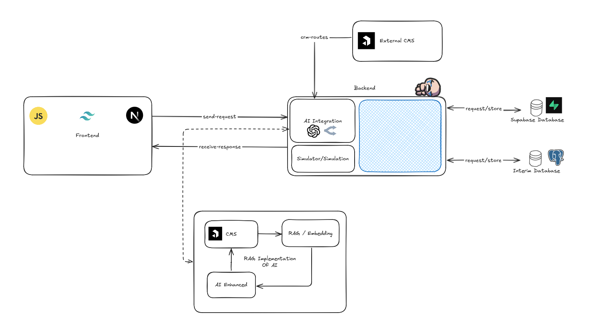

<br />
<div align="center">
  <a href="#">
  
  </a>

<h3 align="center">
    Axion-Web
</h3>
  <p align="center">
    Home for Axion, and the Official Website for all Axion products.
    <br />
    <div align="center">
        <a href="#">Report Bug</a>
        ✱
        <a href="#">Request Feature</a>
        ✱
        <a href="#">Documentation</a>
    </div>
  </p>
</div>
<br>

## Table of Contents

- [Table of Contents](#table-of-contents)
- [Architecture Diagram](#architecture-diagram)
- [Tech Stack](#tech-stack)
  - [Backend](#backend)
  - [Frontend](#frontend)
  - [Development Tools](#development-tools)
  - [Additional Tools](#additional-tools)
  - [Prerequisites](#prerequisites)
  - [Installation](#installation)
  - [Usage](#usage)
- [License](#license)

## Architecture Diagram


The architecture diagram above illustrates the general structure of the application and how each component interacts with one another. Please note that the architecture is subject to change as the project progresses.

## Tech Stack

### Backend
> **TODO**: Add Tools!

### Frontend
> **TODO**: Add Tools!

### Development Tools
> **TODO**: Add Tools!

### Additional Tools

> **TODO**: Add Tools!

**Note**: These tools may not be implemented at the time of reading.

### Prerequisites

Ensure you have the following installed on your machine:
- [Node.js](https://nodejs.org/en/)
- [npm](https://www.npmjs.com/)
- [Git](https://git-scm.com/)
- [Vercel CLI](https://vercel.com/download)
- [Next.js](https://nextjs.org/)
- [axios](https://axios-http.com/)
- [Prisma](https://www.prisma.io/)
- [ESLint](https://eslint.org/)
> **TODO**: Add Tools!

### Installation

1. Clone the repository:
```bash
git clone https://github.com/Axion-HQ/Axion-Web.git .
```

> **Note**: The `.` at the end of the command clones the repository into the current directory instead of creating a new directory.

2. Install the dependencies using the following command:
```bash
npm install
```

3. You can now run the application locally. It is recommended to use the `run.cmd` command to start the application:
```bash
.\run.cmd
```

Alternatively, you can start the application using:
```bash
npm run dev
```

If you prefer not to use `npm`, you can also use `yarn`, `pnpm`, or `bun`:
```bash
yarn dev
# or
pnpm dev
# or
bun dev
```

> **Note**: If you encounter issues, please check the `package.json` file for the correct command.

### Usage

To access the application, navigate to: 
```bash
http://localhost:3000
```

> **NOTE**: All applications build using Next.js will usually run on port `3000`, but this can be changed within the `next.config.js` file.

## License

This project is licensed under the GNU General Public License v3.0 - see the [LICENSE](LICENSE) file for details.

[](https://opensource.org/licenses/MIT)